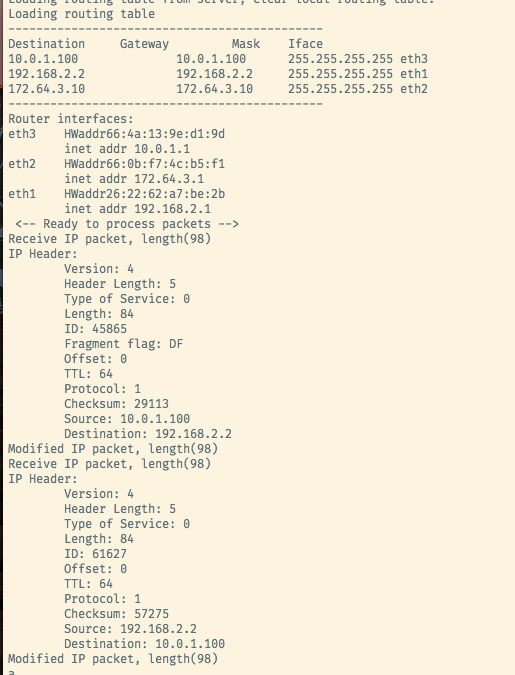
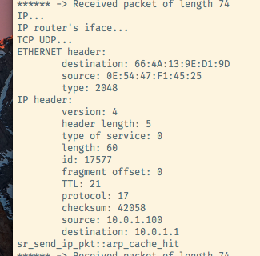
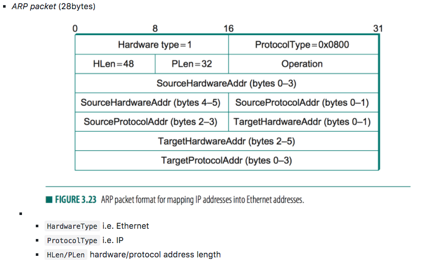

+ steps for sending packet out 
    - [x] look up routing table, `dst_ip -> out_if` (outgoing interface) 
        + use `sr_search_rt(sr, ip)`
    - [] search for arpcache, get `dst_ip -> dst_mac` mapping
        + use `cache_entry sr_arpcache_lookup(cache, ip)`
        + if `cache_entry` exists,
            + update ethernet destination mac with `cache_entry->mac`
            + update ethernet source mac with `out_if->addr`
            + update ethernet protocol type (mostly same)
            + send packet 
        + otherwise, 
            + queues request with `arpcache_queuereq(next_hop_ip, packet, len)`
            + then handle it...


#### Links 

+ [mininet](http://mininet.org/)
    + [doc](https://github.com/mininet/mininet/wiki/Documentation)
    + [walkthrough](http://mininet.org/walkthrough/)
+ [tcpdump](https://en.wikipedia.org/wiki/Tcpdump)
+ [ping utility](https://en.wikipedia.org/wiki/Ping_(networking_utility))
+ [rfc792 icmp](https://tools.ietf.org/html/rfc792)


#### Setup

```bash
# set up vm http://mininet.org/vm-setup-notes/

# set up ssh 
# VirtualBox for macos: Network -> change NAT to bridged
sudo dhclient eth1
ifconfig eth1       # checks for inet addr, 
                    # use this for > ssh mininet@100.64.93.216

# https://csc.cdf.toronto.edu/mybb/archive/index.php/thread-9770-1.html
# install python-dev to so that we have `Python.h` header available for compiling ltprotocol
sudo apt-get install python-dev
# install ltprotocol manually 
git clone git://github.com/dound/ltprotocol.git
cd ltprotocol && sudo python setup.py install
# install necessary utilities
sudo apt-get install traceroute wget

# checkout ~/pox (provided by vm, not ~/cs144_lab3)
cd ~/pox && git checkout f95dd1a81584d716823bbf565fa68254416af603

# configure pox module
cd ~/cs144_lab3 && ./config.sh

# Window 1, pox controller (run it before ./run_mininet.sh)
cd ~/cs144_lab3 && ln -s ../pox && ./run_pox.sh

# Window 2, mininet
cd ~/cs144_lab3 && ./run_mininet.sh

# Window 3, test solution 
cd ~/cs144_lab3 && ./sr_solution

# make 
cd ~/cs144_lab3/router/ && make && ./sr
```

#### Auto tester descriptions 
+ init: untars the archive and starts grader
+ compile: compiles the code by running 'make'
+ ICMP-Shows-ARP-1: 
    + verifies that when the router receives an ICMP echo request, it initiates an ARP request, instead of simply swapping source IP and destination IP in the reply.
+ ARP-Request-[1-2]: 
    + sends an ARP request to one of the router's interfaces and waits for a matching ARP reply.
+ ARP-Caching-1: 
    + sends two successive -identical- ICMP echo requests to one of the router's interfaces, and makes sure that only the first one triggers an ARP request. Notes: 
        + We make sure that this is the first time that the router has to send an IP packet to this address, thus making an ARP request necessary. 
        + The second ICMP echo request is only sent after the first ICMP echo reply has been sent by the router, so there is no race condition with the ARP request / reply.
+ ICMP-Request-Forwarding-[1-2]: 
    + sends an ICMP echo request to the router. This request is not addressed to the router, which needs to forward it (the route is known). We check that the forwarded packet is identical to the original one, apart from the modified IP header.
+ ICMP-Reply-Forwarding-1: 
    + same as above but the packet forwarded is now an ICMP echo reply instead of an ICMP echo request.
+ ICMP-Reply-[1-2]: 
    + checks that the router correctly replies to ICMP echo requests addressed to one of its interfaces. This is different from earlier tests (e.g. ICMP-Shows-ARP-1), which was only interested in the ARP packets involved.
+ ICMP-TTL-Decrease-1: 
    + sends an IP packet to the router (in our case an ICMP echo request) for forwarding and makes sure that the router correctly decrements the TTL field.
+ ICMP-Reply-TTL1-1: 
    + sends an ICMP echo request addressed to one of the router's interfaces with a TTL of 1, and verifies that the router is generating a reply.
+ TCP-Forwarding-1: 
    + same as ICMP-Request-Forwarding and ICMP-Reply-Forwarding, but this time with a TCP packet instead of an ICMP packet. In other words, checks that the router correctly forwards TCP traffic.
+ UDP-Forwarding-1: 
    + same as above but this time we send a UDP packet instead of a TCP one.
+ Port-Unreachable-[1-2]: 
    + sends a TCP packet addressed to one of the router's interfaces, expects an ICMP port unreachable message.
+ Port-Unreachable-3: 
    + same as above but with a UDP packet.
+ Net-Unreachable-1: 
    + sends an ICMP packet to the router for forwarding, but makes sure that the router has no entry for the IP address. Expects an ICMP net unreachable message.
+ Net-Unreachable-2: 
    + same as above but with a TCP packet instead of an ICMP one.
+ Host-Unreachable-1: 
    + sends an ICMP packet to the router for forwarding. The router has a matching entry for the destination IP in its routing table, but the next hop is not replying to ARP requests. Expects an ICMP host unreachable message after roughly 5 seconds (5 timed out ARP requests).
+ Time-Exceed-1: 
    + sends an ICMP packet to the router for forwarding, but with a TTL of 1. The router should drop the packet and generate an ICMP Time Exceed message.
+ Time-Exceed-2: 
    + same as above but with a UDP packet instead of an ICMP one.


### test commands

```sh
client traceroute -n 192.168.2.2
client traceroute -n 192.168.2.1
client traceroute -n 172.64.3.10
client traceroute -n 172.64.3.1
client traceroute -n 10.0.1.1

client traceroute -T -n 192.168.2.2
client traceroute -T -n 192.168.2.1
client traceroute -T -n 172.64.3.10
client traceroute -T -n 172.64.3.1
client traceroute -T -n 10.0.1.1

client ping -c 1 192.168.2.2
client ping -c 1 192.168.2.1
client ping -c 1 172.64.3.10
client ping -c 1 172.64.3.1
client ping -c 1 10.0.1.1

tcpdump -vvv -qns 0 -X -r solution.pcap | less
```

#### pics

+ 
    + tcp udp port unreachable response
+ 
    + changed one

+ 
    + set arp before after
+ 
    + set eth before after


+ 
+ 
+ 
---

+ 
    + arp query broadcast
--- 
> 

+ 
    + `client ping -c 1 192.168.2.2`
    + solution 

+ `client traceroute -n 10.0.1.1`
+  
    + solution : my


+ 
+ 
    + client ping -c 1 10.0.1.100 (router's interface) 
    + first one malloced, second one simply used the request packet


```c
struct sr_ethernet_hdr
{
#ifndef ETHER_ADDR_LEN
#define ETHER_ADDR_LEN 6
#endif
    uint8_t  ether_dhost[ETHER_ADDR_LEN];    /* destination ethernet address */
    uint8_t  ether_shost[ETHER_ADDR_LEN];    /* source ethernet address */
    uint16_t ether_type;                     /* packet type ID */
} __attribute__ ((packed)) ;
typedef struct sr_ethernet_hdr sr_ethernet_hdr_t;

```
+ 
    + ethernet header format
    + `type` 
        ```c
        enum sr_ethertype {
            ethertype_arp = 0x0806,
            ethertype_ip = 0x0800,
        };
        ```


```c
struct sr_ip_hdr
  {
#if __BYTE_ORDER == __LITTLE_ENDIAN
    unsigned int ip_hl:4;		/* header length */
    unsigned int ip_v:4;		/* version */
#elif __BYTE_ORDER == __BIG_ENDIAN
    unsigned int ip_v:4;		/* version */
    unsigned int ip_hl:4;		/* header length */
#else
#error "Byte ordering ot specified " 
#endif 
    uint8_t ip_tos;			/* type of service */
    uint16_t ip_len;			/* total length */
    uint16_t ip_id;			/* identification */
    uint16_t ip_off;			/* fragment offset field */
#define	IP_RF 0x8000			/* reserved fragment flag */
#define	IP_DF 0x4000			/* dont fragment flag */
#define	IP_MF 0x2000			/* more fragments flag */
#define	IP_OFFMASK 0x1fff		/* mask for fragmenting bits */
    uint8_t ip_ttl;			/* time to live */
    uint8_t ip_p;			/* protocol */
    uint16_t ip_sum;			/* checksum of the header, not body */
    uint32_t ip_src, ip_dst;	/* source and dest address */
  } __attribute__ ((packed)) ;
typedef struct sr_ip_hdr sr_ip_hdr_t;
```
+ 
    + ip header format

```c
struct sr_arp_hdr
{
    unsigned short  ar_hrd;             /* format of hardware address (hardware type, ethernet=1)  */
    unsigned short  ar_pro;             /* format of protocol address (protocol type, IP=0x0800)  */
    unsigned char   ar_hln;             /* length of hardware address  (ethernet=48) */
    unsigned char   ar_pln;             /* length of protocol address  (IP=32) */
    unsigned short  ar_op;              /* ARP opcode (command)   (request/reply)    */
    unsigned char   ar_sha[ETHER_ADDR_LEN];   /* sender hardware address      */
    uint32_t        ar_sip;             /* sender IP address            */
    unsigned char   ar_tha[ETHER_ADDR_LEN];   /* target hardware address      */
    uint32_t        ar_tip;             /* target IP address            */
} __attribute__ ((packed)) ;
typedef struct sr_arp_hdr sr_arp_hdr_t;
```
+   
    + arp header format
    + `ar_op`
        ```c
        enum sr_arp_opcode {
            arp_op_request = 0x0001,
            arp_op_reply = 0x0002,
        };
        ```

```c
/* Structure of a ICMP header
 */
struct sr_icmp_hdr {
  uint8_t icmp_type;
  uint8_t icmp_code;
  uint16_t icmp_sum;
  
} __attribute__ ((packed)) ;
typedef struct sr_icmp_hdr sr_icmp_hdr_t;


/* Structure of a type3 ICMP header
 */
struct sr_icmp_t3_hdr {
  uint8_t icmp_type;
  uint8_t icmp_code;
  uint16_t icmp_sum;
  uint16_t unused;
  uint16_t next_mtu;
  uint8_t data[ICMP_DATA_SIZE]; // 28

} __attribute__ ((packed)) ;
typedef struct sr_icmp_t3_hdr sr_icmp_t3_hdr_t;
```
+ 
    + icmp


#### Resources 


+ `pthread_attr_t`
    + `pthread_attr_init`
    +  initializes the thread attributes object pointed to by `attr` with default attribute values

+ `packed` and `align`
    + https://stackoverflow.com/questions/11770451/what-is-the-meaning-of-attribute-packed-aligned4
    + https://stackoverflow.com/questions/8568432/is-gccs-attribute-packed-pragma-pack-unsafe
        + idea is `.` and `->` to access packed struct is fine
        + however not safe to take the pointer of unaligned data and then accessing it without taking that into account.

```c
 /* Internet address. */
struct in_addr {
    uint32_t       s_addr;     /* address in network byte order */
};
```